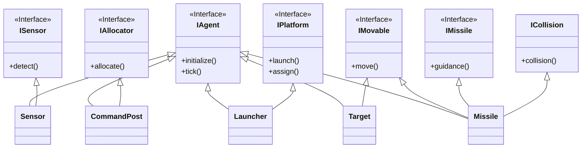
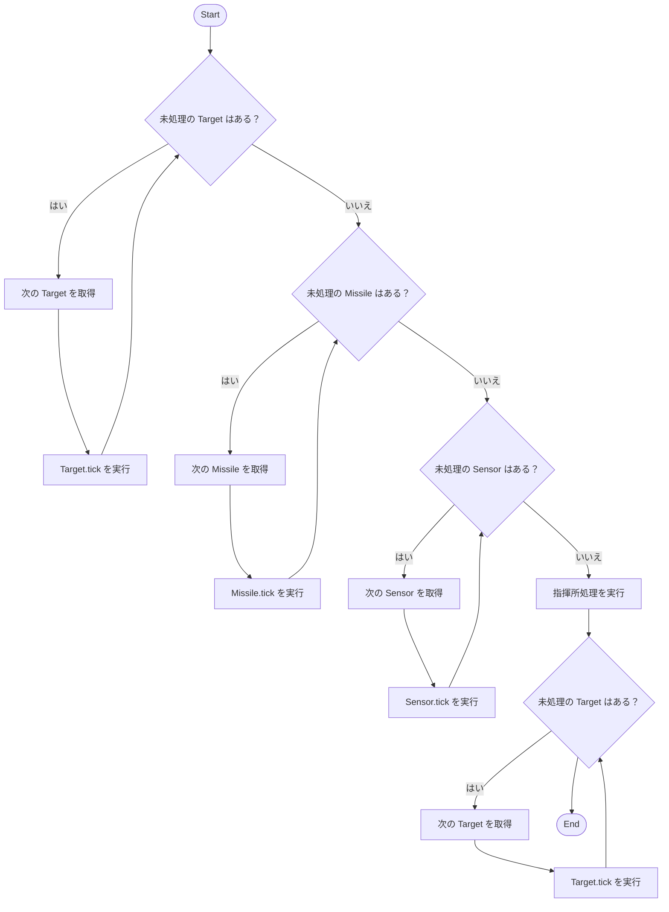
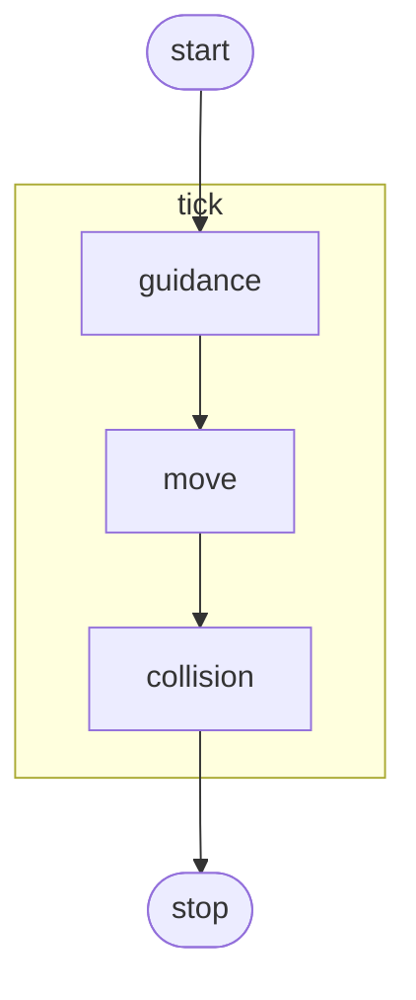

# 防衛シミュレーションアーキテクチャ検討

**目的:** エージェントベースシミュレーションで設計された防衛シミュレーションを複数のシミュレーションアーキテクチャで構築し、
エンティティ数の増加に伴う性能の変化を計測し、エンティティ数に応じた最適なシミュレーションアーキテクチャを検討する。

**指標:** 本検討において、性能の指標は演算速度とメモリ使用量とする。これは、長時間シミュレーション＋多数エンティティの状況において、より早くシミュレーション結果を得ることを目的とするからである。

## 防衛シミュレーションについて
防衛シミュレーションは、エージェントベースシミュレーションである。
また、Δtによる固定時間によるタイムドリブンシミュレーションでもある。
また、以下の種類のエージェントが登場するものとする。

1. 敵(Target)
    - シナリオ値として指定された始点から「指揮所位置」まで等速直線運動を行う
    - 耐久値を性能値として設定することができ、ミサイルの衝突1回につき、1ptづつ減少し、耐久値が0になった場合、撃破される。
    - ターゲットは、シナリオで与えられた「指揮所位置」を中心とした **到達範囲(arrival_radius_m)[m]** を設定し、到達範囲内に侵入したら、突破成功とみなす。（判定は、XY距離(2D)で評価）
    　　- ターゲットが領域外に出ることはないはずだが、出た場合は、消滅とする。
    - ターゲットは複数機をグループとした単位で出現する。
    - グループには、以下のように構成される
        - 所属数
        - 中心位置[m,m]
        - 発射時刻[s]
        - 高度[m]
        - 配置間隔半径[m]
        - 開始角度[deg]
    - 配置間隔半径[m]および開始角度[deg]はシナリオ値で指定する。
    - 高度はグループ単位で共通の値をシナリオ値で指定する。
    - ターゲットが撃破または突破成功した場合は即時消滅し、以降の処理には参加しない。

    - 敵グループの編隊充填
        - リング半径：`r_k = k × 配置間隔半径[m]`（k=1,2,...）。
        - 所属数は内側リングから順に**等角配置**で割り付け、必要なリング数を自動で増やす。
        - `ring_half_offset` オプションが true の場合、2本目以降のリングは方位を **半角**ずらして配置する。

2. 指揮所(CommandPost)
    - 指揮所はシナリオ上、１つしか存在しないものとする
    - 後述するセンサにより探知されたターゲットに対して、迎撃するミサイルを選択し発射指示を行う。
    - 優先度判定は、シナリオで与えられた「指揮所位置」に対する最近接到達時刻で決定する。
       - もし「複数ターゲットが同一優先度の」の場合、XY距離が近い順で優先度を決定する
    - ターゲットには、複数のミサイルをアサインすることができる。アサインできるミサイル数は性能値により指定される。
    - アサインできるミサイル数は、アサインされたミサイルが衝突もしくは自爆すると増える。
    - 敵が指揮所に到達しても、指揮所は破壊されないこととする
    - 指揮所の同時アサイン上限は「**飛翔中ミサイル数**」でカウントする（予約は含めない）。
        - アサイン上限は、敵の耐久度と同じとする。耐久度以上に過剰なミサイルは発射しない
    - 発射ランチャの選定は、**(1) クールダウン最短 → (2) ランチャ位置から目標までの距離が短い → (3) ランチャID昇順** の優先で決定する。

    - 優先度判定（Tgo）
        - 直線等速・XYベースで `Tgo = max(0, (||r_xy|| - arrival_radius_m) / v_target)` と定義する。
    - タイブレークは本文どおり距離（XY）→ID 昇順。

3. センサ(Sensor)
    - 配備された位置から設定値までの範囲に入った敵を検知できる。
       - 探知範囲は、球形半径[m]として扱う
       - 探知判定は、3次元距離で取り扱う
    - 更新周期は、Δtと同周期と考え毎サイクル位置情報をレポートする
        - Δtが大きいと見落としが発生する可能性があるが許容する
    - 報告遅延やロストは存在せず探知範囲内にいれば、確実に探知できるものとする。
    - 探知した結果は、指揮所に伝える
    - レーザの探知誤差は存在しないものとする
    - 地形遮蔽は考慮しないものとする
    - 指揮所への通知は、エージェントのエンティティ番号を直接渡すため、実質重複が起きないものとする。（真値が渡される）
    - センサの検知対象は**敵(Target) のみ**とする。味方およびミサイルは検知対象外。

4. ランチャ(Launcher)
    - 性能値により指定された数だけ、ミサイルを装備できる。補給は考慮しない。
       - デフォルト装備数は4とする
    - ミサイルの連射はできず、1発ミサイルを発射した後は、性能値により指定されたクールダウンタイム後に再発射できる。（逆にいえは、クールダウン中は発射できないし、残弾数ゼロでも発射できない）
       - 発射可否条件 = (残弾 > 0) AND (クールダウン終了)。
    - 発射方位に関する指向性はない
    - ランチャは初期状態で**クールダウン済み**とする（シミュレーション開始直後に即時発射可）。
    - 性能値デフォルト
        - クールダウンタイム: 5[s]

5. ミサイル(Missile)
    - 指揮所より指定されたターゲットに対して、比例航法を用いて追尾する。
        - 比例航法の性能値：**True 3D PN**, `N=3–4`、加速度はベクトル飽和、最大旋回レートは姿勢更新でクリップ。
    - 同一サイクルで複数命中が発生した場合は同時適用し、耐久値を一括減算
    - 性能値として、以下が指定される。
        - 初速度[m/s]
        - 最大速度[m/s]
        - 最大加速度[m/s²]
        - 最大旋回レート[deg/s]
        - 迎撃判定距離[m]
    - 命中判定はΔtごとの更新時にチェックし、迎撃判定距離以内で命中成立とする。
    - 自爆条件
        - 誘導終盤に、指定されたターゲットとの3次元距離(miss distance)が増加したら、ターゲットから離れたと判定し自爆とする
            - mdの増加判定は、性能値で指定されたティック回数(endgame_miss_increase_ticks)分、連続で増加した場合とする。
        - 誘導対象が撃破・突破等で消滅した場合は即時自爆とする。
        - 燃料は考慮しないため、最大飛翔時間は定義しないが、領域外に出た場合は自爆とする。
        - 自爆条件「終盤」は、ターゲット距離 < 2 × 迎撃判定距離以内に入った時点と定義。
    - 数値手順
        - 1サイクルの更新順：**誘導計算 → 加速度ベクトル飽和（|a|≤a_max）→ 速度積分 → 速度上限クリップ（|v|≤v_max）→ 位置更新 → 姿勢更新（|ω|≤ω_max）**。
        - 角度演算は内部ラジアン、設定/ログはdegで表記する。

### 乱数/シード
- 原則乱数は用いないロジックとする。乱数を用いる場合は、設定値にシード値を記載し再現性を持たせるものとする。

### シミュレーション時間について
- シミュレーション時間は、Δt[s]で設定ファイルにより指定できる。
   - デフォルト値は、0.1[s]とする。
- リアルタイム性は考慮しない。純粋なシミュレーション時間でのみ駆動するものとする。
- 処理順序
    - 検知→交戦判断→射撃→運動更新→命中判定の処理順で行う

### シミュレーション終了条件
- 最大シミュレーション時間 Tmax に到達、または敵が全撃破/全突破した時点で終了。

### 座標・単位系について
- すべての座標は3次元空間で取り扱う
- 配備位置等シナリオによる位置指定は、x[m],y[m],z[m]にて指定するものとする。
- すべての距離・位置の単位は m とし、km は用いない
- 0°は+X方向、正の角度は+Zから見て反時計回り(CCW)

### 設定ファイルについて
設定ファイルには、シナリオ値と性能値の2種類に分けられる。
- シナリオ値は、登場する個々のエージェントに対して設定される値である。
- 性能値は、エージェントの種類共通で設定されるエージェントの挙動を定める値である。
- XY 平面で +X を右、+Y を上、+Z を上空とする。

### シナリオ領域と配備位置について
- シナリオ領域は、原点中心±1000000m四方とする
- 敵は、左上(x:-1000000m,y:+1000000m) 右下(x:-500000m,y:-500000m)の矩形範囲の中から発射され、指揮所配備位置に向かって飛行する。
- 味方は、左上(x:500000m,y:-500000m) 右下(x:1000000m,y:-1000000m)の矩形範囲に配備される。
- シナリオの高度範囲は、0[m]~5000[m]とする
- 高度範囲：`z ∈ [0, 5000] (m)` を超えた場合は z をこの範囲に**クランプ**する

## 防衛シミュレーションの設定ファイル

```yaml
# scenario_plane.yaml — 平面版シナリオひな形（単位はすべて m / s / deg）
meta:
  version: "1.0"
  name: "sample_plane"
  description: "平面直交座標シナリオのテンプレ"

sim:
  dt_s: 0.1
  t_max_s: 900
  seed: 0

world:
  # XY平面: +X=右, +Y=上, +Z=上空
  region_rect:              # 原点中心 ±1,000,000 m 四方
    xmin_m: -1000000
    xmax_m:  1000000
    ymin_m: -1000000
    ymax_m:  1000000
  z_limits_m: [0, 5000]     # 高度範囲。逸脱時はクランプ（仕様）
  distance_conventions:
    breakthrough: "XY"      # 突破判定はXY距離
    sensor: "3D"            # センサ探知は3D距離（球形半径）
    launcher_selection: "XY"# ランチャ選定②の距離
    intercept: "3D"         # miss distance / 迎撃判定距離

command_post:
  position: { x_m: 800000, y_m: -800000 }  # 指揮所位置（XY）
  arrival_radius_m: 20000                   # 突破判定の到達範囲

policy:
  # 優先度判定（Tgo）
  tgo_definition: "Tgo = max(0, (||r_xy|| - arrival_radius_m) / v_target)"
  tie_breakers: ["distance_xy", "id_ascending"]
  # ランチャ選定規則
  launcher_selection_order: ["cooldown_shortest", "distance_shortest", "id_ascending"]
  launcher_initially_cooled: true
  # 編隊角度規約（推奨追記）
  angle_reference:
    zero_deg_axis: "+X"     # 0°は+X方向
    rotation: "CCW"         # +Zから見て反時計回りを正
  # ミサイル誘導
  missile_guidance:
    type: "true_3d_pn"
    N: 3.5
    endgame_factor: 2.0       # 終盤= 2 × intercept_radius
    endgame_miss_increase_ticks: 3  # 連続増加ティック閾値（実装を安定させる任意設定）
  missile_kinematics_defaults:
    initial_speed_mps: 300
    max_speed_mps: 1200
    max_accel_mps2: 80
    max_turn_rate_deg_s: 40
    intercept_radius_m: 50

friendly_forces:
  deploy_rect_xy:            # 参考・配置域（任意）
    xmin_m:  500000
    xmax_m: 1000000
    ymin_m: -1000000
    ymax_m:  -500000

  sensors:
    - id: S001
      pos: { x_m: 750000, y_m: -900000, z_m: 50 }
      range_m: 180000
    - id: S002
      pos: { x_m: 900000, y_m: -700000, z_m: 50 }
      range_m: 150000

  launchers:
    - id: L001
      pos: { x_m: 780000, y_m: -850000, z_m: 20 }
      missiles_loaded: 4
      cooldown_s: 5
    - id: L002
      pos: { x_m: 880000, y_m: -820000, z_m: 20 }
      missiles_loaded: 4
      cooldown_s: 5

enemy_forces:
  spawn_rect_xy:
    xmin_m: -1000000
    xmax_m:  -500000
    ymin_m:  -500000
    ymax_m:  1000000

  # 複数編隊の例
  groups:
    - id: G001_wave1
      spawn_time_s: 120
      center_xy: { x_m: -800000, y_m: 600000 }  # グループ中心（XY）
      z_m: 3000                                  # グループ共通高度
      count: 12                                  # 所属数
      ring_spacing_m: 1500
      start_angle_deg: 0
      ring_half_offset: true
      endurance_pt: 2                             # 耐久（1命中=1pt減）
      # 目的地は「指揮所位置」想定のため個別destは不要（仕様）

    - id: G002_wave2
      spawn_time_s: 300
      center_xy: { x_m: -700000, y_m: 200000 }
      z_m: 2500
      count: 8
      ring_spacing_m: 1200
      start_angle_deg: 30
      ring_half_offset: true
      endurance_pt: 1

missile_defaults:
  # 必要なら個別ミサイル種を定義して参照してもよい
  kinematics:
    initial_speed_mps: 300
    max_speed_mps: 1200
    max_accel_mps2: 80
    max_turn_rate_deg_s: 40
    intercept_radius_m: 50
```

## ソフトウェアアーキテクチャ
防衛シミュレーションは、オブジェクト指向をもとにしたエージェントシミュレーションとして構成する。

### クラス基本構成

- クラス構成は、共通部分をインタフェースでまとめたファサードパターンを用いる
- クラスメソッドの引数は省略


### 処理フロー
#### メインフロー


#### Missile Tick処理フロー


### プログラム言語
実装言語は、Rustとします。